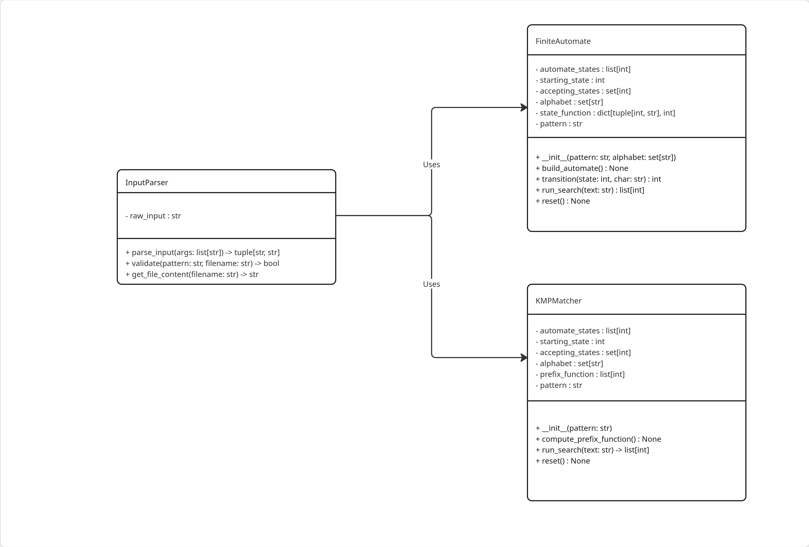

# JFiTT — lab_1

A short description of the repository and the source files used in the assignment.

## Project Structure

Below is the directory tree with the most important files of the project:

```
├── CMakeLists.txt
├── README.md
├── src/
│   ├── main.cpp
│   ├── InputParser.cpp
│   ├── FiniteAutomate.cpp
│   └── KMPMatcher.cpp
├── include/
│   ├── InputParser.hpp
│   ├── FiniteAutomate.hpp
│   └── KMPMatcher.hpp
└── tests/
    ├── CMakeLists.txt
    └── test_main.cpp
```

### Directory Description

- **src/** — Main source code files.
- **include/** — Header files for classes and interfaces.
- **tests/** — Unit test sources and CMake configuration for tests.
- **CMakeLists.txt** — CMake build configuration file.
- **README.md** — This documentation file.

## UML Diagrams



## How to Build and Run

### 1. Configure the project

```sh
cmake -B build -S .
```

- `-B build` — Sets the build directory (all build artifacts will be stored in `build/`).
- `-S .` — Sets the source directory (the location of your `CMakeLists.txt`).

### 2. Build the project

```sh
cmake --build build
```
- This command builds the project using the configuration in the `build/` directory.

### 3. Run the program

```sh
./build/pattern_search <FA|KMP> <pattern> <filename>
```
- The first argument selects the algorithm (`FA` for finite automaton, `KMP` for Knuth-Morris-Pratt).
- The second argument is the pattern string to search for.
- The third argument is the name of the text file to search in.

#### Example usage

```sh
./build/pattern_search FA test pattern.txt
```

## Notes

- **Step 1** (CMake configuration) should be repeated whenever you change the `CMakeLists.txt` file (e.g., add new source files).
- **Step 2** (building) is enough if you only change the contents of source/header files.
- The program is run according to step 3.
- All code follows modern C++ standards and the project is structured for clarity and maintainability.

## Author

Marcelele-0
